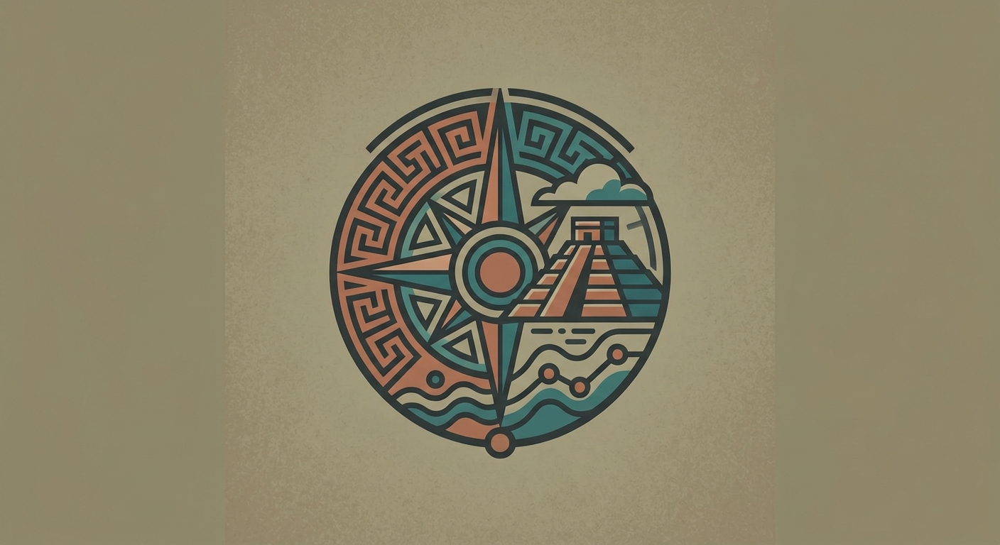

<p align="center">
  
</p>

<h1 align="center">Tezcat</h1>

<p align="center">
  <strong>A GIS and cartography studio.</strong>
</p>

<p align="center">
  <a href="https://github.com/npc-worldwide/tezcat/blob/main/LICENSE"></a>
  <a href="https://github.com/npc-worldwide/tezcat/releases"></a>
</p>

<p align="center">
  <a href="https://github.com/npc-worldwide/tezcat/releases"><strong>Download for Linux, macOS, and Windows</strong></a>
</p>

---

Tezcat is a desktop-first geospatial studio that brings together a 2D GIS map, a 3D NASA imagery globe, and open geospatial data tooling in one fast workspace. Built for cartography, OSINT research, and exploring earth-observation imagery without a browser.

Built on Electron + React with the map, globe, and viewer components from [npcts](https://github.com/npc-worldwide/npcts).

### Highlights

- **GIS Map** — A 2D Leaflet map with basemaps (OSM, satellite, topo, dark, light), tile overlays, and reference GeoJSON layers (countries, states, cities, airports, ports, rivers, railroads, and more). Draw and manage your own vector layers per project.
- **3D Globe** — A three.js globe with NASA GIBS imagery (MODIS true color, VIIRS, Black Marble, and more), a date picker, a layer switcher, and a high-resolution detailed zoom pass for regional imagery.
- **OSINT layers** — Toggle OpenStreetMap Overpass presets (hospitals, police, fire, military, surveillance, cell towers, power plants, helipads, and more) fetched live for the current viewport, plus custom Overpass queries.
- **Open data catalog** — Quick access to open geospatial sources (Natural Earth, OSM Overpass, GEBCO, CHIRPS, Open-Elevation) with one-click GeoJSON import into your project.
- **CORS-safe fetching** — External fetches route through an Electron main-process `proxyFetch` so Overpass, Nominatim, and GIBS work without a network proxy.
- **Import / export** — Load KML/GPX/GeoJSON into projects and export features back to KML.
- **Local-first** — Your projects and layers stay on disk.

---

## Setup

### 1. Install

Download the installer for your platform from the [releases page](https://github.com/npc-worldwide/tezcat/releases), run it, and launch Tezcat. Linux (`.deb`/`.AppImage`), macOS (`.dmg`), and Windows (`.exe`) builds are provided.

### 2. First launch

Tezcat opens to the **GIS Map** tab. Use the sidebar to switch between Layers, Properties, Reference overlays, and OSINT. The top tab bar switches between GIS Map, Data, and Globe.

### 3. Add layers

- **Layers** — Draw and toggle your own vector layers.
- **Ref** — Toggle tile overlays and reference GeoJSON layers.
- **OSINT** — Toggle Overpass presets or run a custom query; results can be added to your project as features.

### 4. Explore the globe

Switch to the **Globe** tab for 3D NASA GIBS imagery. Pick a base layer and date, scroll to zoom, and the detailed zoom pass fetches high-resolution regional imagery as you zoom in.

---

## Development setup

Tezcat is an Electron + React + TypeScript frontend with a small Python backend (`tezcat_serve.py`) powered by [npcpy](https://github.com/npc-worldwide/npcpy).

### Prerequisites

- Node.js 22+ and npm
- Python 3.10+ with [npcpy](https://github.com/npc-worldwide/npcpy) installed

### Install

```bash
git clone https://github.com/npc-worldwide/tezcat.git
cd tezcat
npm install --legacy-peer-deps
```

### Run

```bash
npm run dev
```

The dev frontend runs on port `7341`.

### Build

```bash
npm run build
```

This builds the renderer, Electron main, and preload scripts, then packages the app with electron-builder. To package for a specific platform:

```bash
npx electron-builder --mac
npx electron-builder --win
npx electron-builder --linux
```

---

## Community

- **Issues & Bugs**: [GitHub Issues](https://github.com/npc-worldwide/tezcat/issues)
- **NPC Ecosystem**: [npcpy](https://github.com/npc-worldwide/npcpy) | [npcsh](https://github.com/npc-worldwide/npcsh) | [npcts](https://github.com/npc-worldwide/npcts)

## License

Tezcat is licensed under the MIT License. See the [LICENSE](LICENSE) file for details.